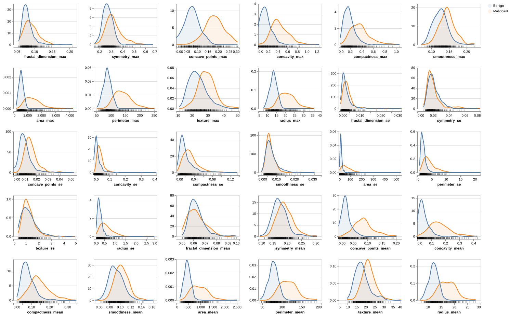
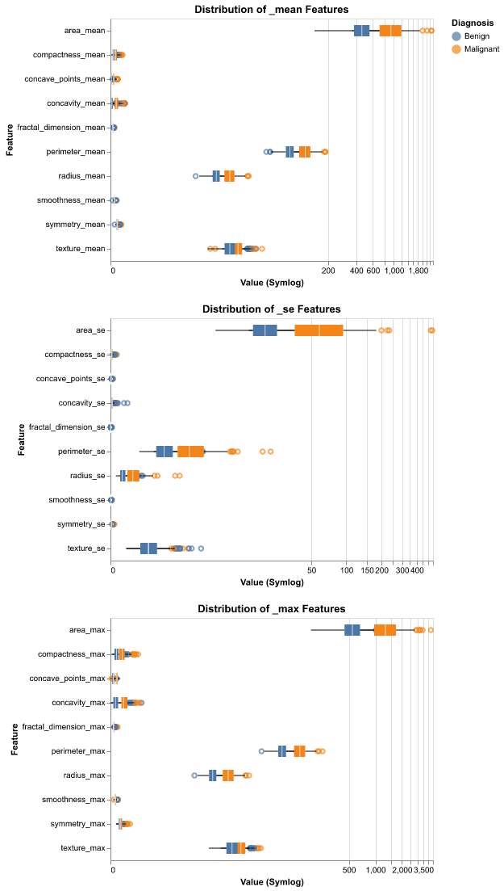
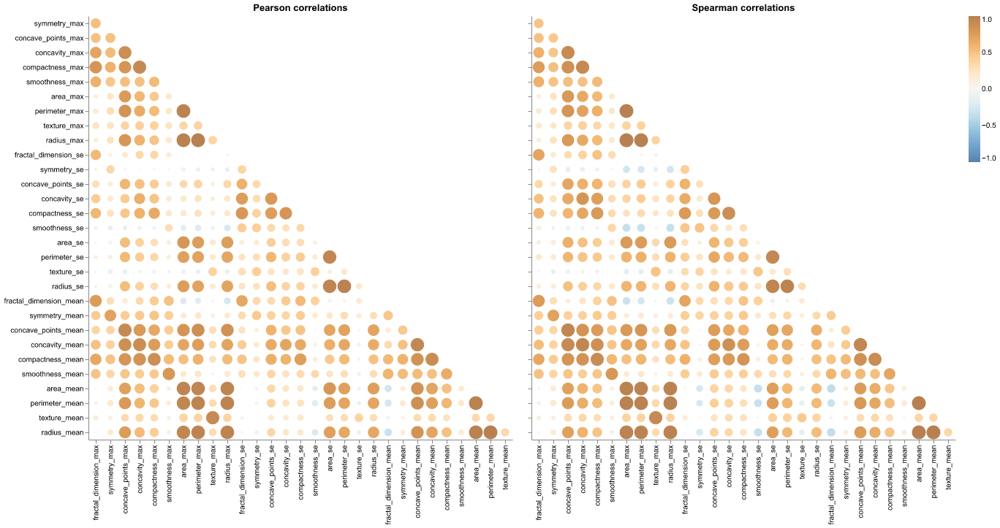
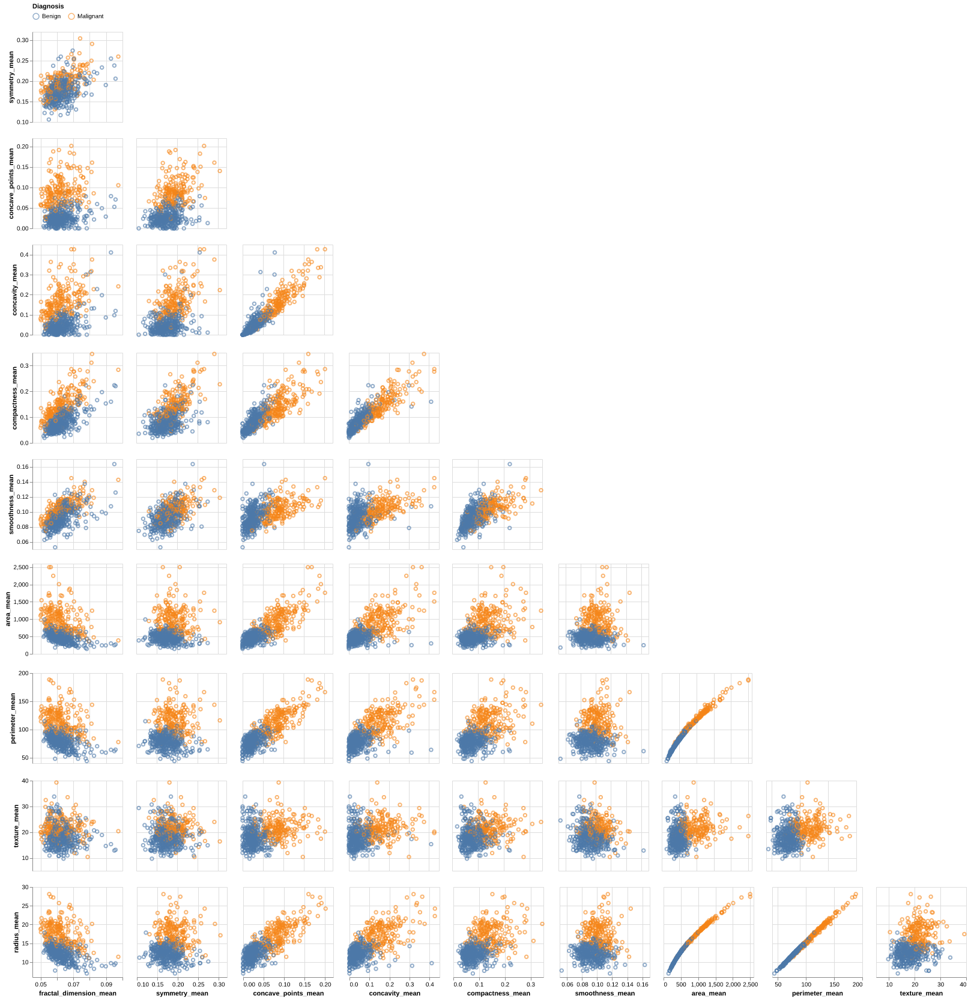
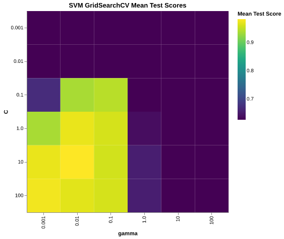
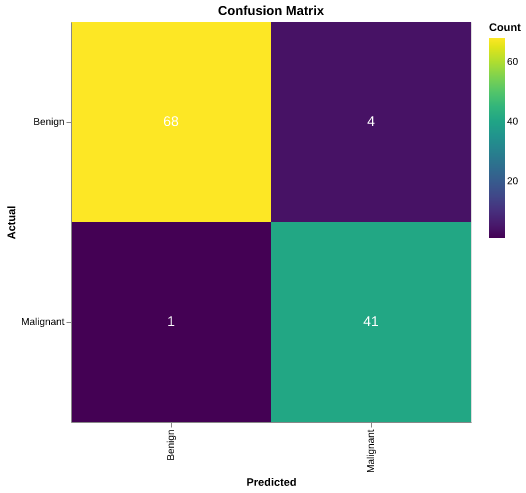

# Summary

This project develops a Support Vector Machine (SVM) classification model to predict whether breast tumours are benign or malignant using digitized image measurements. 
Our final classifier achieved high performance on the test set with 104 correctly classified cases out of 109 samples. 
However, the model produced one false negative—misclassifying a malignant tumour as benign—which represents a significant 
clinical concern. While the overall accuracy is promising, further model refinement is necessary before clinical deployment 
to minimize false negatives, which could delay critical treatment interventions.

# Introduction

Breast cancer remains one of the most prevalent cancers among women, with early detection shown to dramatically improve outcomes [@canadian2019cancer]. 
Patients diagnosed at early stages have a 5-year survival rate of 99%, compared to only 31% for late-stage diagnoses [@street1993nuclear]. 
Traditional tumour diagnosis methods can be subjective and depend heavily on physician experience. 

An accurate machine learning classifier could provide several benefits:

- **Objectivity:** Reducing subjectivity in diagnosis by providing consistent, data-driven predictions
- **Scalability:** Enabling more efficient screening programs in resource-limited settings
- **Early intervention:** Supporting faster diagnostic pathways to improve patient outcomes
- **Clinical decision support:** Assisting physicians by flagging high-risk cases for additional review

Since benign tumours remain localized and stop growing, while malignant tumours invade surrounding tissues and metastasize, 
accurate classification is critical for determining appropriate treatment pathways. Thus, if a machine learning algorithm 
can succesfully classify tumours we can expect substantially improved patient outcomes.

## Research Question

Can we build a machine learning model to accurately predict whether a newly discovered breast tumour is benign or 
malignant based on digitized image measurements of tumour cell nuclei?

# Methods

All data manipulation and analysis was performed using Python [@python] and the following packages: pandas [@mckinney2010data] for data manipulation, NumPy [@harris2020array] for numerical computing, scikit-learn [@pedregosa2011scikit] for machine learning algorithms, and Altair [@vanderplas2018altair] for visualization. The computational environment was containerized using Docker [@docker].

## Data

The Wisconsin Diagnostic Breast Cancer (WDBC) dataset was retrieved from the UCI Machine Learning  Repository  [@dua2019uci]. Created by Dr. William H. Wolberg, W. Nick Street, and Olvi L. Mangasarian at the University of Wisconsin-Madison, the dataset contains measurements computed from digitized images of fine needle aspirate (FNA) samples of breast masses.

The dataset consists of:

- 569 instances (357 benign, 212 malignant)
- 30 real-valued features representing measurements of cell nuclei characteristics
- 1 binary target variable (Diagnosis: Benign or Malignant)

Each feature represents one of ten cell nucleus characteristics (radius, texture, perimeter, area, smoothness, compactness, concavity, concave points, symmetry, and fractal dimension) computed in three forms:

- Mean value across cells
- Standard error (SE) of the values
- Maximum ("worst") value observed

### Feature Analysis

#### Distribution Analysis

Figure 1 shows the distribution of all 30 features colored by diagnosis class. Key observations include:

- **Size-related features** (`radius_mean`, `perimeter_mean`, `area_mean`) show clear separation between benign (blue) and malignant (orange) tumours, with malignant tumours exhibiting consistently larger values
- **Shape complexity features** (`concavity_mean`, `concave_points_mean`) demonstrate strong discriminative power, with malignant tumours showing higher irregularity
- **Texture and smoothness features** display substantial overlap between classes, suggesting lower individual predictive value
- **Right skewness** is evident in area and concavity features, particularly in their standard error (`_se`) variants

{#fig-dist_chart}

#### Outlier Analysis

Numerous outliers were observed, particularly in malignant samples for size-related features as shown in Figure 2. 
These extreme values are not data errors but represent biologically meaningful signals characteristic of aggressive tumour growth. 
Therefore, these outliers were retained in the analysis as they contain critical diagnostic information.

{#fig-feature_distributions}

#### Correlation Analysis  

Figure 3 presents Pearson and Spearman correlation matrices revealing severe multicollinearity. Key findings:

- Near-perfect correlation (r > 0.95) between `radius`, `perimeter`, and `area` across all three statistical forms (_mean, _se, _max)
- Strong positive correlations (r > 0.85) among `concavity`, `concave_points`, and `compactness`
- Similar correlation patterns observed in both Pearson (linear) and Spearman (monotonic) metrics.

This multicollinearity is geometrically expected but creates redundancy that can destabilize models and inflate variance.

{#fig-corr_chart}

#### Pairwise Separability

The pairplot (Figure 4) visualizes 2D relationships between selected features. Size-related features (`radius_mean`, `area_mean`) combined with 
shape complexity metrics (`concavity_mean`, `concave_points_mean`) demonstrate clear class separation with minimal overlap. 
The curved relationship between `area` and `radius` reinforces the geometric redundancy identified in correlation analysis.

{#fig-pair_chart}

#### Initial Findings

* **Class Separation:**
    * **High Separability:** Features related to **size** (`radius`, `perimeter`, `area`) and **concavity** (`concave_points`, `concavity`) show clear distinction between Benign and Malignant classes (Malignant samples generally have higher values).
    * **Low Separability:** Texture, Smoothness, and Fractal Dimension show significant overlap, indicating they are weaker individual predictors.
* **Distributions:**
    * **Skewness:** "Area" and "Concavity" features (both `_mean` and `_se`) are heavily **right-skewed**.
    * **Outliers:** Visible in the upper tails of `area_max` and `perimeter_se`.
* **Correlations (Multicollinearity):**
    * **Severe Multicollinearity:** `radius`, `perimeter`, and `area` are highly correlated. This is expected geometrically but redundant for models.
    * `concavity`, `concave_points`, and `compactness` also exhibit very high positive correlation.

### Preprocessing Pipeline

Based on our primary exploration of the data, the following was implemented within our model:

1.  **Feature Selection:**
    * We removed redundant features to reduce multicollinearity.
2.  **Scaling:**
    * Since our features vary vastly in scale (e.g., `area` > 1000 vs. `smoothness` < 0.2). We used **`StandardScaler`** to standardize all features to unit variance.

### Model Development

A Support Vector Machine (SVM) classifier with radial basis function (RBF) kernel was selected. SVM was chosen because:

- It performs well on high-dimensional data
- It is effective with clear class separation as observed in our intial feature analysis

#### Hyperparameter Tuning

Grid search with 15-fold cross-validation was performed to optimize:

- `C` (regularization parameter): [0.001, 0.01, 0.1, 1.0, 10.0, 100.0]
- `gamma` (kernel coefficient): [0.001, 0.01, 0.1, 1.0, 10.0, 100.0]

Figure 5 shows the heatmap of mean test scores across the hyperparameter grid. The optimal hyperparameters were:

- `C = 10.0`
- `gamma = 0.001`

{#fig-svm_heatmap}

These values provided the best balance between model complexity and generalization performance, 
achieving the highest mean cross-validation score.

# Results & Discussion

## Model Performance

The final SVM classifier demonstrated strong performance on the test set. Figure 1 presents the confusion matrix, showing:

- **True Negatives (Benign correctly classified):** 68 cases
- **False Positives (Benign misclassified as Malignant):** 4 cases  
- **False Negatives (Malignant misclassified as Benign):** 1 case
- **True Positives (Malignant correctly classified):** 41 cases

{#fig-con_mat_heatmap}

Overall test accuracy: 95.61% (109 correct predictions out of 114 test samples)

The model's strong performance aligns with expectations based on the clear feature patterns observed during
our initial feature analysis. Size and shape complexity features provided strong discriminative signals, enabling accurate 
classification in most cases.

However, the presence of **one false negative** represents the primary concern. In a clinical context, false negatives are 
significantly more harmful than false positives. A false negative could lead to:

- Delayed diagnosis and treatment initiation
- Disease progression to more advanced, less treatable stages  
- Reduced survival probability

Moreover, while the four false positives (benign tumours classified as malignant) are less critical as they are likely to lead to follow-up testing 
rather than immediate treatment, they still represent unnecessary patient anxiety and healthcare costs.

## Clinical Implications

The model's 96% accuracy is promising but insufficient for clinical deployment as a standalone diagnostic tool. 
Medical applications require extremely high sensitivity for malignant cases to minimize false negatives. T
he single false negative in this small test set suggests the model may produce several missed diagnoses across larger patient populations.

## Limitations

Several limitations affect the interpretation of these results:

- **Small test set:** With only 114 test samples, performance estimates have wide confidence intervals
- **Single dataset source:** Model generalizability to other populations or imaging equipment is unknown  
- **Feature engineering:** Limited exploration of feature interactions or polynomial features

## Future Work

To improve model reliability for clinical use, we recommend:

1. **Class weight adjustment:** Increase the penalty for false negatives during training to prioritize recall over precision
2. **Ensemble methods:** Combine multiple classifiers to improve robustness
3. **External validation:** Test on independent datasets from different medical centers to assess generalizability  
4. **Feature engineering:** Explore interaction terms and domain-specific features to capture complex patterns
5. **Error analysis:** Conduct detailed investigation of misclassified cases to identify systematic patterns

# References

::: {#refs}
:::

